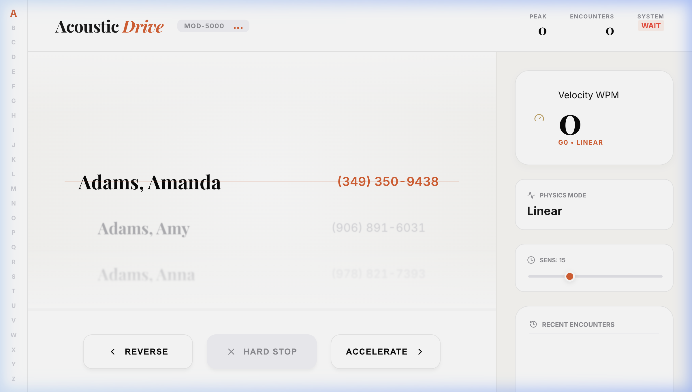

# Interface Breakdown: Acoustic Drive

This document provides a visual and functional breakdown of the Acoustic Drive system as implemented for CS 8903.

## 1. Primary Navigation Dashboard
The dashboard is designed for high-density information display while maintaining clean visual anchors for testing.

### Key Functional Zones:
- **Alphabet Quick-Nav (Far Left)**: Provides immediate structural context. The highlighted letter reflects the current section of the sorted list being traversed.
- **Velocity Meter (Right Sidebar)**: Real-time readout of the current Word-Per-Minute (WPM) equivalent and the active physics gear.
- **Voice Pulse (Top Center)**: Real-time visual confirmation of audio engine activity. Essential for debugging the "Gears 4-6" transition where natural speech is replaced by structural landmarks.
- **Encounter Ticker (Bottom Right)**: A historical log of traversed entries, allowing the user to verify the "Items Scanned" metric.

## 2. Interaction Model
The system uses tactile keyboard shortcuts to simulate an "accelerator" and "brake" mechanism.

- **W (Increase Gear)**: Shifts up, increasing the scroll velocity.
- **S (Decrease Gear)**: Shifts down, decelerating or initiating reverse motion.
- **A (Emergency Stop)**: Immediately kills all velocity and clears the audio buffer.

## 3. Visual Scrubber
The discrete orange bar at the very bottom provides a linear representation of the current position within the 5,000-item dataset ($0\% \rightarrow 100\%$).
